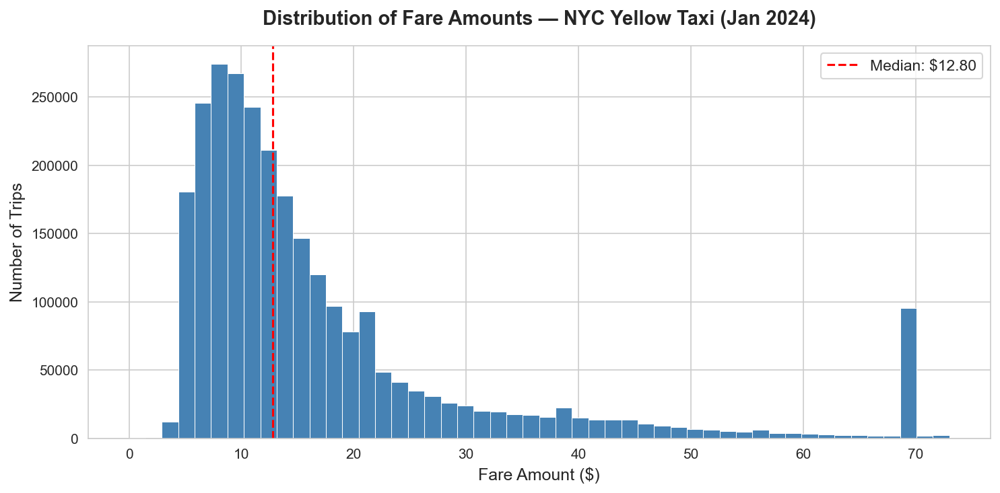
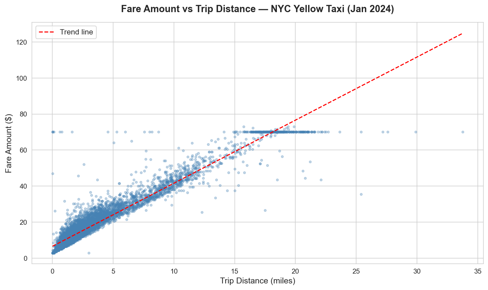
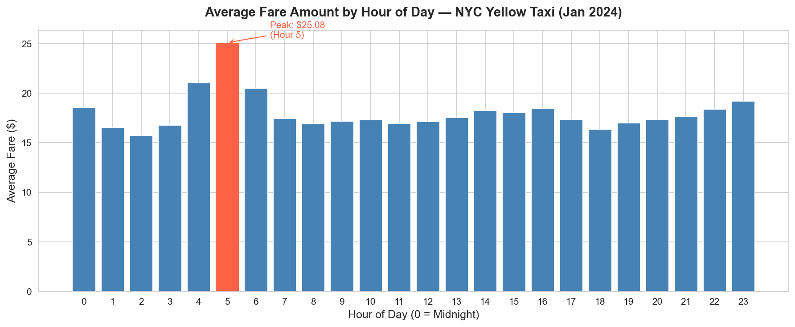
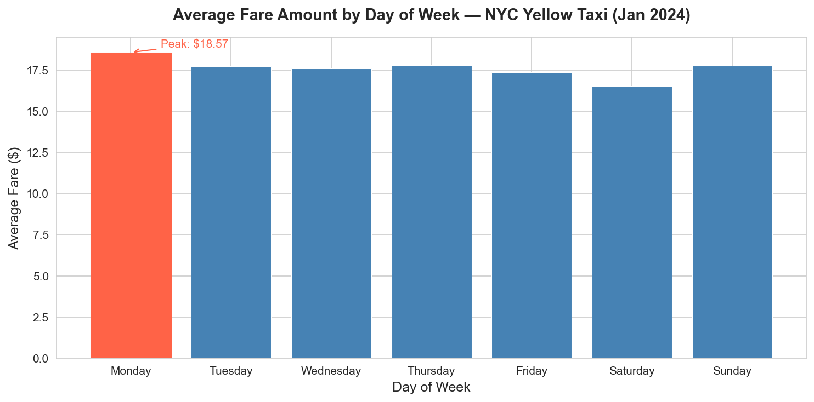
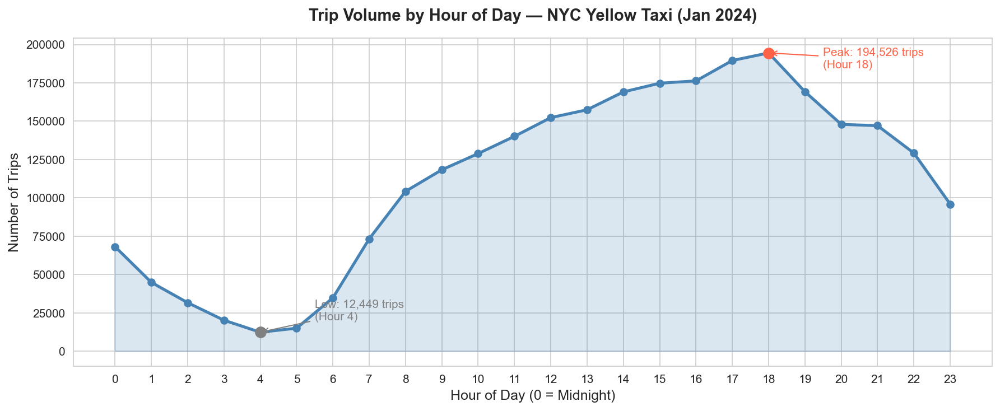

# NYC Taxi Fare Predictor

**Client:** RideMetrics Inc. (fictional)  
**Data:** NYC TLC Yellow Taxi Trip Data — January 2024  
**Author:** Shadman Shahreaz  

---

## Project Overview

Built an end-to-end data analysis and machine learning pipeline on
2.96 million real-world NYC taxi trips to predict fare amounts and
surface actionable insights for fleet and pricing strategy.

---

## Results

| Metric | Value |
|---|---|
| Model | Linear Regression |
| R² Score | 0.9231 |
| MAE | $2.41 |
| RMSE | $4.07 |
| Training rows | 2,156,957 |
| Test rows | 539,240 |

---

## Key Findings

- **Distance is the dominant fare driver** — every additional mile adds $3.50
- **Early morning commands the highest fares** — 5 AM average fare is $25.08
  driven by airport runs before public transit starts
- **Evening rush drives volume** — 6 PM peaks at 194,526 trips
- **JFK flat-rate trips ($70)** create a distinct fare cluster that a
  metered model cannot predict — a separate classification layer is recommended
- **Weekends are cheaper** — Saturday average fare is $0.91 below Monday

---

## Visualizations

### Fare Distribution


### Fare vs Trip Distance


### Average Fare by Hour


### Average Fare by Day of Week


### Trip Volume by Hour


---

## Project Structure

```
nyc-taxi-fare-predictor/
├── data/              # Data folder (parquet file not included — too large)
├── notebooks/         # Jupyter notebook with full analysis
├── visuals/           # All 5 EDA charts
├── requirements.txt   # Python dependencies
└── README.md
```

---

## How to Run

```bash
# Clone the repo
git clone https://github.com/Sshahreaz/nyc-taxi-fare-predictor.git

# Install dependencies
pip install -r requirements.txt

# Download the data
# https://d37ci6vzurychx.cloudfront.net/trip-data/yellow_tripdata_2024-01.parquet
# Place in the data/ folder

# Open the notebook
jupyter notebook notebooks/nyc_taxi_fare.ipynb
```

---

## Data Pipeline Summary

| Phase | Action | Outcome |
|---|---|---|
| Ingestion | Loaded Jan 2024 parquet | 2,964,624 rows × 19 columns |
| Cleaning | 6 business rules applied | 267,843 rows removed (9.0%) |
| Feature Engineering | 5 new features created | trip_duration, hour, day, weekend, speed |
| EDA | 5 visualizations produced | Key patterns identified |
| Modeling | Linear Regression trained | R² = 0.9231, MAE = $2.41 |

---

## Tech Stack

`Python 3.13` · `pandas` · `numpy` · `matplotlib` · `seaborn` · `scikit-learn` · `pyarrow` · `Jupyter`

---

## Recommendations for RideMetrics Inc.

1. Target airport corridors for highest per-trip revenue
2. Incentivize early morning shifts (4 AM–6 AM)
3. Build a two-model system — classifier for flat-rate trips + regressor for metered fares
4. Enrich with weather and event data to push R² above 0.95
5. Re-run analysis on summer months to capture seasonal patterns
